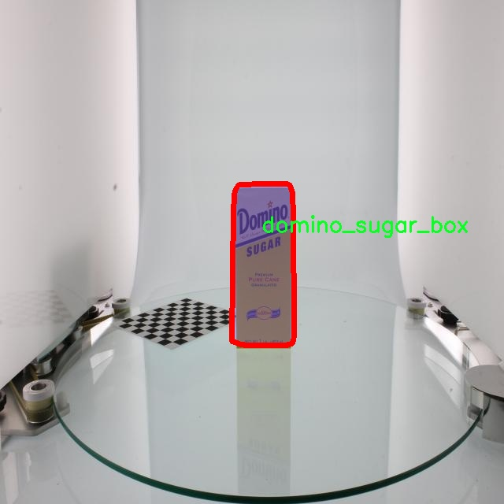

# 日常物品图像分割系统源码＆数据集分享
 [yolov8-seg-C2f-DAttention＆yolov8-seg-AIFI等50+全套改进创新点发刊_一键训练教程_Web前端展示]

### 1.研究背景与意义

项目参考[ILSVRC ImageNet Large Scale Visual Recognition Challenge](https://gitee.com/YOLOv8_YOLOv11_Segmentation_Studio/projects)

项目来源[AAAI Global Al lnnovation Contest](https://kdocs.cn/l/cszuIiCKVNis)

研究背景与意义

随着计算机视觉技术的迅猛发展，物体检测与图像分割在智能家居、自动驾驶、机器人视觉等领域的应用日益广泛。尤其是在日常物品的识别与分割任务中，如何准确、高效地提取图像中的物体信息，成为了研究者们关注的焦点。YOLO（You Only Look Once）系列模型因其高效的实时处理能力和较高的准确率，已成为物体检测领域的经典方法。YOLOv8作为该系列的最新版本，进一步提升了检测精度和速度，适用于多种复杂场景。然而，针对日常物品的图像分割，现有的YOLOv8模型仍存在一定的局限性，尤其是在处理物体边界模糊、遮挡和多样性方面。因此，基于改进YOLOv8的日常物品图像分割系统的研究显得尤为重要。

本研究选用YCB数据集作为基础数据集，该数据集包含9900张图像，涵盖33类日常物品，如苹果、乒乓球、刀具等。这些物品在日常生活中普遍存在，具有较高的实用价值。YCB数据集的丰富性和多样性为模型的训练和测试提供了良好的基础，能够有效提升模型在实际应用中的泛化能力。通过对这些物品进行实例分割，不仅可以实现对物体的精确定位，还能为后续的物体识别、跟踪和交互提供重要的支持。

在本研究中，我们将对YOLOv8模型进行改进，重点关注以下几个方面：首先，通过引入深度学习中的注意力机制，增强模型对物体特征的提取能力，从而提高分割精度；其次，结合多尺度特征融合技术，提升模型在处理不同尺寸物体时的表现；最后，采用数据增强和迁移学习等策略，提升模型的鲁棒性和适应性，以应对实际应用中可能遇到的各种挑战。

本研究的意义不仅在于提升YOLOv8在日常物品图像分割任务中的性能，更在于为智能视觉系统的开发提供一种新的思路和方法。通过实现高效的物体分割，我们可以为智能家居、机器人等领域的应用提供更为精准的视觉感知能力，进而推动相关技术的发展。此外，本研究还将为后续的研究者提供一个可复现的实验平台，促进学术界和工业界在物体检测与分割领域的进一步探索。

综上所述，基于改进YOLOv8的日常物品图像分割系统的研究，不仅具有重要的理论价值，还有着广泛的应用前景。通过对日常物品的精确分割，我们将能够推动智能视觉技术的进步，为实现更智能化的生活方式奠定基础。

### 2.图片演示


##### 注意：由于此博客编辑较早，上面“2.图片演示”和“3.视频演示”展示的系统图片或者视频可能为老版本，新版本在老版本的基础上升级如下：（实际效果以升级的新版本为准）

  （1）适配了YOLOV8的“目标检测”模型和“实例分割”模型，通过加载相应的权重（.pt）文件即可自适应加载模型。

  （2）支持“图片识别”、“视频识别”、“摄像头实时识别”三种识别模式。

  （3）支持“图片识别”、“视频识别”、“摄像头实时识别”三种识别结果保存导出，解决手动导出（容易卡顿出现爆内存）存在的问题，识别完自动保存结果并导出到tempDir中。

  （4）支持Web前端系统中的标题、背景图等自定义修改，后面提供修改教程。

  另外本项目提供训练的数据集和训练教程,暂不提供权重文件（best.pt）,需要您按照教程进行训练后实现图片演示和Web前端界面演示的效果。

### 3.视频演示

[3.1 视频演示](https://www.bilibili.com/video/BV1VDSkYrEZN/)

### 4.数据集信息展示

##### 4.1 本项目数据集详细数据（类别数＆类别名）

nc: 33
names: ['apple', 'baseball', 'bowl', 'cheez_it_cracker_box', 'dice', 'domino_sugar_box', 'fork', 'french_mustard_bottle', 'golf_ball', 'jell_o_chocolate_pudding_box', 'jell_o_strawberry_gelatin_box', 'knife', 'lemon', 'master_chef_coffee_can', 'mini_soccer_ball', 'mug', 'orange', 'peach', 'pear', 'plastic_banana', 'plate', 'plum', 'pringles_chips_can', 'racquetball', 'rubik_cube', 'scrub_cleanser_bottle', 'soft_ball', 'spam_potted_meat_can', 'spoon', 'starkist_tuna_fish_can', 'strawberry', 'tennis_ball', 'tomato_soup_can']


##### 4.2 本项目数据集信息介绍

数据集信息展示

在本研究中，我们采用了“YCB Dataset”作为训练数据集，以改进YOLOv8-seg的日常物品图像分割系统。该数据集包含33个类别的日常物品，涵盖了广泛的生活场景，旨在为物体检测和分割任务提供丰富的样本。每个类别的物品都是在真实环境中拍摄的，确保了数据的多样性和真实性。这种多样性不仅增强了模型的泛化能力，还提高了其在实际应用中的有效性。

“YCB Dataset”中的类别包括常见的水果，如苹果、柠檬、桃子和梨，这些物品在日常生活中经常出现，且具有鲜明的颜色和形状特征，适合用于图像分割任务。此外，数据集中还包含了多种包装食品和日用品，例如切达干酪饼干盒、番茄汤罐、迷你足球、橄榄球、斯巴达金枪鱼罐等。这些物品的多样性使得模型能够学习到不同物体的形状、纹理和颜色特征，从而在分割任务中表现出色。

在类别的选择上，数据集不仅涵盖了食品和水果，还包括了一些日常使用的器具，如刀、叉、勺、碗和盘子等。这些物品的形状和用途各异，为模型提供了丰富的训练样本，帮助其在复杂场景中更好地识别和分割物体。例如，叉和刀的细长形状与其他物品相比具有显著的特征，这使得模型在处理这些物体时能够更加精准。

此外，数据集中还包含了一些玩具和游戏物品，如魔方、乒乓球和软球等，这些物品的颜色鲜艳、形状独特，能够有效地帮助模型学习到如何在不同背景下进行物体分割。这些玩具的多样性也为模型提供了更广泛的应用场景，使其在处理不同类型的图像时具备更强的适应能力。

总的来说，“YCB Dataset”通过丰富的类别和多样的物品，为改进YOLOv8-seg的日常物品图像分割系统提供了坚实的基础。该数据集不仅在数量上满足了训练需求，更在质量上为模型的学习提供了保障。通过对这些日常物品的有效分割，模型能够在实际应用中实现更高的准确性和效率，推动计算机视觉技术在日常生活中的应用和发展。随着研究的深入，我们期待通过不断优化模型和数据集，进一步提升图像分割的性能，使其在更广泛的场景中发挥作用。




### 5.全套项目环境部署视频教程（零基础手把手教学）

[5.1 环境部署教程链接（零基础手把手教学）](https://www.bilibili.com/video/BV1jG4Ve4E9t/?vd_source=bc9aec86d164b67a7004b996143742dc)


[5.2 安装Python虚拟环境创建和依赖库安装视频教程链接（零基础手把手教学）](https://www.bilibili.com/video/BV1nA4VeYEze/?vd_source=bc9aec86d164b67a7004b996143742dc)

### 6.手把手YOLOV8-seg训练视频教程（零基础小白有手就能学会）

[6.1 手把手YOLOV8-seg训练视频教程（零基础小白有手就能学会）](https://www.bilibili.com/video/BV1cA4VeYETe/?vd_source=bc9aec86d164b67a7004b996143742dc)


按照上面的训练视频教程链接加载项目提供的数据集，运行train.py即可开始训练



     Epoch   gpu_mem       box       obj       cls    labels  img_size
     1/200     0G   0.01576   0.01955  0.007536        22      1280: 100%|██████████| 849/849 [14:42<00:00,  1.04s/it]
               Class     Images     Labels          P          R     mAP@.5 mAP@.5:.95: 100%|██████████| 213/213 [01:14<00:00,  2.87it/s]
                 all       3395      17314      0.994      0.957      0.0957      0.0843

     Epoch   gpu_mem       box       obj       cls    labels  img_size
     2/200     0G   0.01578   0.01923  0.007006        22      1280: 100%|██████████| 849/849 [14:44<00:00,  1.04s/it]
               Class     Images     Labels          P          R     mAP@.5 mAP@.5:.95: 100%|██████████| 213/213 [01:12<00:00,  2.95it/s]
                 all       3395      17314      0.996      0.956      0.0957      0.0845

     Epoch   gpu_mem       box       obj       cls    labels  img_size
     3/200     0G   0.01561    0.0191  0.006895        27      1280: 100%|██████████| 849/849 [10:56<00:00,  1.29it/s]
               Class     Images     Labels          P          R     mAP@.5 mAP@.5:.95: 100%|███████   | 187/213 [00:52<00:00,  4.04it/s]
                 all       3395      17314      0.996      0.957      0.0957      0.0845


### 7.50+种全套YOLOV8-seg创新点代码加载调参视频教程（一键加载写好的改进模型的配置文件）

[7.1 50+种全套YOLOV8-seg创新点代码加载调参视频教程（一键加载写好的改进模型的配置文件）](https://www.bilibili.com/video/BV1Hw4VePEXv/?vd_source=bc9aec86d164b67a7004b996143742dc)

### 8.YOLOV8-seg图像分割算法原理

原始YOLOV8-seg算法原理

YOLOV8-seg作为YOLO系列中的一员，继承了YOLO系列在目标检测领域的诸多优点，同时针对分割任务进行了专门的优化与改进。YOLOV8-seg的设计理念在于将目标检测与实例分割相结合，力求在保持高效检测速度的同时，提升对复杂场景中目标的分割精度。其核心原理基于anchor-free检测方法，这一方法相较于传统的anchor-based检测方式，显著提高了检测精度与速度，尤其在处理小目标和复杂背景时表现出色。

YOLOV8-seg的网络结构主要由四个模块组成：输入端、主干网络、Neck端和输出端。输入端负责对输入图像进行预处理，包括Mosaic数据增强、自适应图像缩放和灰度填充等操作。这些预处理步骤旨在增强模型的鲁棒性，使其能够更好地适应不同的输入条件。主干网络则是特征提取的核心部分，采用了CSPDarknet结构，通过卷积和池化等操作提取图像特征。YOLOV8-seg在主干网络中引入了C2f模块，替代了YOLOv5中的C3模块，进一步提高了特征提取的效率和准确性。

在Neck端，YOLOV8-seg采用了基于PAN（Path Aggregation Network）结构的设计，通过上采样、下采样和特征拼接等操作，对不同尺度的特征图进行融合。这一过程不仅保留了丰富的上下文信息，还有效地增强了模型对小目标的感知能力。特别是在复杂水面环境下，YOLOV8-seg能够更好地处理小目标漂浮物的特征，降低定位误差。

输出端则采用了decoupled head结构，实现了分类和回归过程的解耦。这一设计使得模型在处理分类和定位任务时能够更加灵活高效。在损失计算方面，YOLOV8-seg引入了BCE（Binary Cross-Entropy）损失函数用于分类损失的计算，同时使用DFL（Distribution Focal Loss）和CIoU（Complete Intersection over Union）损失函数来计算回归损失。这些损失函数的选择旨在提高模型的泛化能力和精确度，使其在多样化的应用场景中表现出色。

为了进一步提升YOLOV8-seg在复杂环境下的性能，研究者们针对其原始算法进行了多项改进。首先，考虑到主干网络在下采样过程中可能引入的噪声，YOLOV8-seg引入了BiFormer双层路由注意力机制构建的C2fBF模块。该模块旨在捕获远程依赖关系，保留特征提取过程中更细粒度的上下文信息，从而提升模型对目标的感知能力。

其次，为了解决小目标漏检的问题，YOLOV8-seg在网络中添加了一个更小的检测头，以增强对小目标的检测能力。此外，在Neck端引入了GSConv和Slim-neck技术，这些技术的结合不仅保持了模型的精度，还有效降低了计算量，使得YOLOV8-seg在实时检测任务中表现得更加高效。

最后，YOLOV8-seg还使用了MPDIoU（Multi-Point Distance Intersection over Union）损失函数替代了CIoU损失函数。这一改进旨在进一步提高模型的定位精度和泛化能力，使其在面对复杂场景时能够更好地适应不同的目标特征和背景变化。

总的来说，YOLOV8-seg算法在原有YOLO系列的基础上，通过引入多种新技术和改进措施，成功实现了目标检测与实例分割的有机结合。其在复杂环境下的优越性能，尤其是在小目标检测和分割任务中的表现，展示了YOLOV8-seg在计算机视觉领域的广泛应用潜力。通过不断优化和创新，YOLOV8-seg不仅提升了目标检测的精度和速度，还为未来的研究和应用提供了新的思路和方向。


### 9.系统功能展示（检测对象为举例，实际内容以本项目数据集为准）

图9.1.系统支持检测结果表格显示

  图9.2.系统支持置信度和IOU阈值手动调节

  图9.3.系统支持自定义加载权重文件best.pt(需要你通过步骤5中训练获得)

  图9.4.系统支持摄像头实时识别

  图9.5.系统支持图片识别

  图9.6.系统支持视频识别

  图9.7.系统支持识别结果文件自动保存

  图9.8.系统支持Excel导出检测结果数据


### 10.50+种全套YOLOV8-seg创新点原理讲解（非科班也可以轻松写刊发刊，V11版本正在科研待更新）

#### 10.1 由于篇幅限制，每个创新点的具体原理讲解就不一一展开，具体见下列网址中的创新点对应子项目的技术原理博客网址【Blog】：


[10.1 50+种全套YOLOV8-seg创新点原理讲解链接](https://gitee.com/qunmasj/good)

#### 10.2 部分改进模块原理讲解(完整的改进原理见上图和技术博客链接)【如果此小节的图加载失败可以通过CSDN或者Github搜索该博客的标题访问原始博客，原始博客图片显示正常】
### YOLOv8简介
#### Backbone


借鉴了其他算法的这些设计思想

借鉴了VGG的思想，使用了较多的3×3卷积，在每一次池化操作后，将通道数翻倍；

借鉴了network in network的思想，使用全局平均池化（global average pooling）做预测，并把1×1的卷积核置于3×3的卷积核之间，用来压缩特征；（我没找到这一步体现在哪里）

使用了批归一化层稳定模型训练，加速收敛，并且起到正则化作用。

    以上三点为Darknet19借鉴其他模型的点。Darknet53当然是在继承了Darknet19的这些优点的基础上再新增了下面这些优点的。因此列在了这里

借鉴了ResNet的思想，在网络中大量使用了残差连接，因此网络结构可以设计的很深，并且缓解了训练中梯度消失的问题，使得模型更容易收敛。

使用步长为2的卷积层代替池化层实现降采样。（这一点在经典的Darknet-53上是很明显的，output的长和宽从256降到128，再降低到64，一路降低到8，应该是通过步长为2的卷积层实现的；在YOLOv8的卷积层中也有体现，比如图中我标出的这些位置）

#### 特征融合

模型架构图如下

  Darknet-53的特点可以这样概括：（Conv卷积模块+Residual Block残差块）串行叠加4次

  Conv卷积层+Residual Block残差网络就被称为一个stage


上面红色指出的那个，原始的Darknet-53里面有一层 卷积，在YOLOv8里面，把一层卷积移除了

为什么移除呢？

        原始Darknet-53模型中间加的这个卷积层做了什么？滤波器（卷积核）的个数从 上一个卷积层的512个，先增加到1024个卷积核，然后下一层卷积的卷积核的个数又降低到512个

        移除掉这一层以后，少了1024个卷积核，就可以少做1024次卷积运算，同时也少了1024个3×3的卷积核的参数，也就是少了9×1024个参数需要拟合。这样可以大大减少了模型的参数，（相当于做了轻量化吧）

        移除掉这个卷积层，可能是因为作者发现移除掉这个卷积层以后，模型的score有所提升，所以才移除掉的。为什么移除掉以后，分数有所提高呢？可能是因为多了这些参数就容易，参数过多导致模型在训练集删过拟合，但是在测试集上表现很差，最终模型的分数比较低。你移除掉这个卷积层以后，参数减少了，过拟合现象不那么严重了，泛化能力增强了。当然这个是，拿着你做实验的结论，反过来再找补，再去强行解释这种现象的合理性。

过拟合


通过MMdetection官方绘制册这个图我们可以看到，进来的这张图片经过一个“Feature Pyramid Network(简称FPN)”，然后最后的P3、P4、P5传递给下一层的Neck和Head去做识别任务。 PAN（Path Aggregation Network）


“FPN是自顶向下，将高层的强语义特征传递下来。PAN就是在FPN的后面添加一个自底向上的金字塔，对FPN补充，将低层的强定位特征传递上去，

FPN是自顶（小尺寸，卷积次数多得到的结果，语义信息丰富）向下（大尺寸，卷积次数少得到的结果），将高层的强语义特征传递下来，对整个金字塔进行增强，不过只增强了语义信息，对定位信息没有传递。PAN就是针对这一点，在FPN的后面添加一个自底（卷积次数少，大尺寸）向上（卷积次数多，小尺寸，语义信息丰富）的金字塔，对FPN补充，将低层的强定位特征传递上去，又被称之为“双塔战术”。

FPN层自顶向下传达强语义特征，而特征金字塔则自底向上传达强定位特征，两两联手，从不同的主干层对不同的检测层进行参数聚合,这样的操作确实很皮。
#### 自底向上增强

而 PAN（Path Aggregation Network）是对 FPN 的一种改进，它的设计理念是在 FPN 后面添加一个自底向上的金字塔。PAN 引入了路径聚合的方式，通过将浅层特征图（低分辨率但语义信息较弱）和深层特征图（高分辨率但语义信息丰富）进行聚合，并沿着特定的路径传递特征信息，将低层的强定位特征传递上去。这样的操作能够进一步增强多尺度特征的表达能力，使得 PAN 在目标检测任务中表现更加优秀。


### 可重参化EfficientRepBiPAN优化Neck
#### Repvgg-style
Repvgg-style的卷积层包含
卷积+ReLU结构，该结构能够有效地利用硬件资源。

在训练时，Repvgg-style的卷积层包含
卷积、
卷积、identity。（下图左图）


在推理时，通过重参数化（re-parameterization），上述的多分支结构可以转换为单分支的
卷积。（下图右图）


基于上述思想，作者设计了对GPU硬件友好的EfficientRep Backbone和Rep-PAN Neck，将它们用于YOLOv6中。

EfficientRep Backbone的结构图：


Rep-PAN Neck结构图：


#### Multi-path
只使用repvgg-style不能达到很好的精度-速度平衡，对于大模型，作者探索了多路径的网络结构。

参考该博客提出了Bep unit，其结构如下图所示：


CSP（Cross Stage Partial）-style计算量小，且有丰富的梯度融合信息，广泛应用于YOLO系列中，比如YOLOv5、PPYOLOE。

作者将Bep unit与CSP-style结合，设计了一种新的网络结构BepC3，如下图所示：


基于BepC3模块，作者设计了新的CSPBep Backbone和CSPRepPAN Neck，以达到很好的精度-速度平衡。

其他YOLO系列在使用CSP-stype结构时，partial ratio设置为1/2。为了达到更好的性能，在YOLOv6m中partial ratio的值为2/3，在YOLOv6l中partial ratio的值为1/2。

对于YOLOv6m，单纯使用Rep-style结构和使用BepC3结构的对比如下图所示：

#### BIFPN
BiFPN 全称 Bidirectional Feature Pyramid Network 加权双向（自顶向下 + 自低向上）特征金字塔网络。

相比较于PANet，BiFPN在设计上的改变：

总结下图：
图d 蓝色部分为自顶向下的通路，传递的是高层特征的语义信息；红色部分是自底向上的通路，传递的是低层特征的位置信息；紫色部分是上述第二点提到的同一层在输入节点和输入节点间新加的一条边。


我们删除那些只有一条输入边的节点。这么做的思路很简单：如果一个节点只有一条输入边而没有特征融合，那么它对旨在融合不同特征的特征网络的贡献就会很小。删除它对我们的网络影响不大，同时简化了双向网络；如上图d 的 P7右边第一个节点

如果原始输入节点和输出节点处于同一层，我们会在原始输入节点和输出节点之间添加一条额外的边。思路：以在不增加太多成本的情况下融合更多的特性；

与只有一个自顶向下和一个自底向上路径的PANet不同，我们处理每个双向路径(自顶向下和自底而上)路径作为一个特征网络层，并重复同一层多次，以实现更高层次的特征融合。如下图EfficientNet 的网络结构所示，我们对BiFPN是重复使用多次的。而这个使用次数也不是我们认为设定的，而是作为参数一起加入网络的设计当中，使用NAS技术算出来的。


Weighted Feature Fusion 带权特征融合：学习不同输入特征的重要性，对不同输入特征有区分的融合。
设计思路：传统的特征融合往往只是简单的 feature map 叠加/相加 (sum them up)，比如使用concat或者shortcut连接，而不对同时加进来的 feature map 进行区分。然而，不同的输入 feature map 具有不同的分辨率，它们对融合输入 feature map 的贡献也是不同的，因此简单的对他们进行相加或叠加处理并不是最佳的操作。所以这里我们提出了一种简单而高效的加权特融合的机制。
常见的带权特征融合有三种方法，分别是：


​
  这种方法比较简单，直接加一个可学习的权重。但是由于这个权重不受限制，所有可能引起训练的不稳定，所有并不推荐。
Softmax-based fusion: O = ∑ i e w i ∗ I i ϵ + ∑ j e w j O = \sum_{i} \frac{e^{w_i} * I_i}{ \epsilon+\sum_{j}e^{w_j}}O=∑ 

 

​
  使用这种方法可以将范围放缩到 [ 0 , 1 ] [0, 1][0,1] 之间，训练稳定，但是训练很慢，所有也不推荐。
Fast normalized fusion: O = ∑ i w i ∗ I i ϵ + ∑ j w j O = \sum_{i} \frac{w_i * I_i}{ \epsilon+\sum_{j}w_j}O=∑ 


### 11.项目核心源码讲解（再也不用担心看不懂代码逻辑）

#### 11.1 ultralytics\engine\exporter.py

以下是经过简化和注释的YOLOv8模型导出代码的核心部分。此代码主要用于将YOLOv8模型导出为多种格式，包括PyTorch、ONNX、TensorFlow等。

```python
import json
import os
import shutil
import subprocess
import time
import warnings
from copy import deepcopy
from datetime import datetime
from pathlib import Path

import numpy as np
import torch

from ultralytics.cfg import get_cfg
from ultralytics.utils import (LOGGER, __version__, get_default_args, yaml_save)
from ultralytics.utils.checks import check_imgsz, check_requirements
from ultralytics.utils.torch_utils import select_device

def try_export(inner_func):
    """导出装饰器，用于捕获导出过程中的异常并记录日志。"""
    inner_args = get_default_args(inner_func)

    def outer_func(*args, **kwargs):
        """执行导出操作并记录时间和结果。"""
        prefix = inner_args['prefix']
        try:
            start_time = time.time()
            f, model = inner_func(*args, **kwargs)
            LOGGER.info(f"{prefix} 导出成功 ✅ 用时 {time.time() - start_time:.1f}s，保存为 '{f}'")
            return f, model
        except Exception as e:
            LOGGER.error(f'{prefix} 导出失败 ❌: {e}')
            raise e

    return outer_func

class Exporter:
    """模型导出类，负责处理模型的导出逻辑。"""

    def __init__(self, cfg='default_cfg.yaml', overrides=None):
        """初始化导出器，加载配置。"""
        self.args = get_cfg(cfg, overrides)
        self.callbacks = []  # 存储回调函数

    @try_export
    def export_onnx(self, model, prefix='ONNX:'):
        """导出ONNX格式的模型。"""
        # 检查所需的库
        check_requirements(['onnx>=1.12.0'])
        import onnx  # 导入ONNX库

        # 设置导出文件名
        f = str(model.file.with_suffix('.onnx'))
        # 导出模型
        torch.onnx.export(model, model.im, f, input_names=['images'], output_names=['output0'])
        return f, None

    @try_export
    def export_torchscript(self, model, prefix='TorchScript:'):
        """导出TorchScript格式的模型。"""
        f = model.file.with_suffix('.torchscript')
        ts = torch.jit.trace(model, model.im)
        ts.save(str(f))
        return f, None

    def __call__(self, model):
        """执行导出过程。"""
        self.run_callbacks('on_export_start')
        # 选择设备
        self.device = select_device('cpu')
        # 进行模型导出
        exported_files = []
        if self.args.format == 'onnx':
            exported_files.append(self.export_onnx(model))
        elif self.args.format == 'torchscript':
            exported_files.append(self.export_torchscript(model))
        # 记录导出结束
        self.run_callbacks('on_export_end')
        return exported_files

    def run_callbacks(self, event):
        """执行指定事件的所有回调函数。"""
        for callback in self.callbacks:
            callback(event)

# 示例用法
# model = YOLO('yolov8n.pt')  # 加载YOLO模型
# exporter = Exporter(cfg='export_config.yaml')  # 创建导出器
# exported_files = exporter(model)  # 执行导出
```

### 代码注释说明：
1. **try_export**: 这是一个装饰器，用于包装导出函数，捕获异常并记录导出时间和结果。
2. **Exporter类**: 负责模型的导出逻辑，包括初始化、导出不同格式的模型（如ONNX和TorchScript）。
3. **export_onnx**: 导出ONNX格式的模型，使用`torch.onnx.export`函数。
4. **export_torchscript**: 导出TorchScript格式的模型，使用`torch.jit.trace`进行模型跟踪。
5. **__call__方法**: 使得Exporter对象可以被调用，执行导出过程并选择设备。

### 注意事项：
- 该代码是简化版，省略了完整的导出逻辑和所有格式的导出函数。
- 具体的模型和配置文件需要根据实际情况进行调整。

这个文件是Ultralytics YOLOv8模型的导出模块，主要用于将训练好的YOLOv8模型导出为多种格式，以便在不同的框架和平台上使用。文件中包含了多种导出格式的支持，包括PyTorch、ONNX、TensorFlow、CoreML、TensorRT等。

文件的开头部分是一些文档字符串，详细列出了支持的导出格式、相应的命令行参数以及如何使用这些功能。接着，文件导入了一系列必要的库和模块，包括PyTorch、NumPy、以及Ultralytics自定义的模块。

`export_formats`函数返回一个DataFrame，列出了所有支持的导出格式及其相关信息。`gd_outputs`函数用于获取TensorFlow GraphDef模型的输出节点名称。

`try_export`是一个装饰器，用于捕获导出过程中的异常，并记录导出成功或失败的信息。

`Exporter`类是整个导出过程的核心。它的构造函数接受配置文件路径和其他参数，并初始化导出器的配置。`__call__`方法是导出模型的主要逻辑，首先运行导出开始的回调，然后根据指定的格式进行模型导出。在导出过程中，它会检查设备类型、模型参数、输入大小等，确保导出过程的顺利进行。

在导出过程中，`Exporter`类会根据用户指定的格式调用不同的导出方法，如`export_torchscript`、`export_onnx`、`export_coreml`等。这些方法分别实现了将模型导出为相应格式的具体逻辑，并在导出完成后返回文件路径。

此外，文件中还定义了一些辅助函数和类，例如`IOSDetectModel`，用于将YOLO模型封装为适合iOS CoreML导出的格式。

整体来看，这个文件的结构清晰，功能模块化，便于扩展和维护。它为用户提供了灵活的模型导出选项，使得YOLOv8模型能够在不同的深度学习框架和设备上进行推理。

#### 11.2 ultralytics\utils\ops.py

以下是代码中最核心的部分，并附上详细的中文注释：

```python
import torch
import torchvision

def non_max_suppression(
        prediction,
        conf_thres=0.25,
        iou_thres=0.45,
        classes=None,
        agnostic=False,
        multi_label=False,
        labels=(),
        max_det=300,
        nc=0,  # 类别数量（可选）
        max_time_img=0.05,
        max_nms=30000,
        max_wh=7680,
):
    """
    对一组边界框执行非最大抑制（NMS），支持掩码和每个框多个标签。

    参数：
        prediction (torch.Tensor): 形状为 (batch_size, num_classes + 4 + num_masks, num_boxes) 的张量，
            包含预测的框、类别和掩码。张量应符合模型输出格式，例如 YOLO。
        conf_thres (float): 置信度阈值，低于该值的框将被过滤。有效值在 0.0 和 1.0 之间。
        iou_thres (float): IoU 阈值，低于该值的框在 NMS 期间将被过滤。有效值在 0.0 和 1.0 之间。
        classes (List[int]): 要考虑的类别索引列表。如果为 None，则考虑所有类别。
        agnostic (bool): 如果为 True，模型对类别数量不敏感，所有类别将被视为一个类别。
        multi_label (bool): 如果为 True，每个框可能有多个标签。
        labels (List[List[Union[int, float, torch.Tensor]]]): 每个图像的先验标签列表。
        max_det (int): NMS 后要保留的最大框数量。
        nc (int, optional): 模型输出的类别数量。该数量之后的索引将被视为掩码。
        max_time_img (float): 处理一张图像的最大时间（秒）。
        max_nms (int): 传递给 torchvision.ops.nms() 的最大框数量。
        max_wh (int): 框的最大宽度和高度（像素）。

    返回：
        (List[torch.Tensor]): 长度为 batch_size 的列表，每个元素是形状为 (num_boxes, 6 + num_masks) 的张量，
            包含保留的框，列为 (x1, y1, x2, y2, confidence, class, mask1, mask2, ...)。
    """

    # 检查置信度和IoU阈值的有效性
    assert 0 <= conf_thres <= 1, f'Invalid Confidence threshold {conf_thres}, valid values are between 0.0 and 1.0'
    assert 0 <= iou_thres <= 1, f'Invalid IoU {iou_thres}, valid values are between 0.0 and 1.0'
    
    # 如果预测结果是列表或元组，选择推理输出
    if isinstance(prediction, (list, tuple)):
        prediction = prediction[0]  # 选择推理输出

    device = prediction.device  # 获取设备信息
    bs = prediction.shape[0]  # 批次大小
    nc = nc or (prediction.shape[1] - 4)  # 类别数量
    nm = prediction.shape[1] - nc - 4  # 掩码数量
    mi = 4 + nc  # 掩码起始索引
    xc = prediction[:, 4:mi].amax(1) > conf_thres  # 置信度候选框

    output = [torch.zeros((0, 6 + nm), device=prediction.device)] * bs  # 初始化输出

    for xi, x in enumerate(prediction):  # 遍历每张图像的推理结果
        x = x[xc[xi]]  # 过滤掉低于置信度阈值的框

        # 如果没有剩余框，处理下一张图像
        if not x.shape[0]:
            continue

        # 分离边界框、类别和掩码
        box, cls, mask = x.split((4, nc, nm), 1)

        # 处理多标签情况
        if multi_label:
            i, j = torch.where(cls > conf_thres)
            x = torch.cat((box[i], x[i, 4 + j, None], j[:, None].float(), mask[i]), 1)
        else:  # 仅保留最佳类别
            conf, j = cls.max(1, keepdim=True)
            x = torch.cat((box, conf, j.float(), mask), 1)[conf.view(-1) > conf_thres]

        # 过滤特定类别
        if classes is not None:
            x = x[(x[:, 5:6] == torch.tensor(classes, device=x.device)).any(1)]

        n = x.shape[0]  # 当前框的数量
        if not n:  # 如果没有框，继续处理下一张图像
            continue
        if n > max_nms:  # 如果框的数量超过最大限制，按置信度排序并移除多余框
            x = x[x[:, 4].argsort(descending=True)[:max_nms]]

        # 执行批量 NMS
        c = x[:, 5:6] * (0 if agnostic else max_wh)  # 类别
        boxes, scores = x[:, :4] + c, x[:, 4]  # 框（按类别偏移），置信度
        i = torchvision.ops.nms(boxes, scores, iou_thres)  # NMS
        i = i[:max_det]  # 限制检测结果数量

        output[xi] = x[i]  # 保存当前图像的输出

    return output  # 返回所有图像的检测结果
```

### 代码说明：
1. **非最大抑制（NMS）**：该函数用于从多个预测框中筛选出最有可能的框，去除重叠度高的框，以提高检测精度。
2. **参数说明**：
   - `prediction`：模型输出的预测框及其相关信息。
   - `conf_thres`：置信度阈值，低于该值的框将被丢弃。
   - `iou_thres`：交并比阈值，用于判断框之间的重叠程度。
   - `classes`：需要考虑的类别列表。
   - `multi_label`：是否支持每个框多个标签。
3. **返回值**：返回每张图像经过 NMS 处理后的框信息，包含坐标、置信度和类别等信息。

这个程序文件 `ultralytics/utils/ops.py` 是一个与 YOLO（You Only Look Once）目标检测模型相关的工具库，主要包含了一些用于处理图像、边界框和掩膜的函数。文件中定义了多个函数和一个上下文管理器类，具体功能如下：

首先，`Profile` 类是一个用于性能分析的上下文管理器，可以用来测量代码块的执行时间。通过使用 `with Profile() as dt:` 语句，可以方便地记录代码执行的时间，并在结束时输出总耗时。

接下来，`segment2box` 函数用于将一个分割标签转换为一个边界框标签，确保转换后的边界框在图像内部。它接收一个分割的坐标张量，并返回最小和最大 x、y 值的数组。

`scale_boxes` 函数用于根据原始图像和目标图像的尺寸重新缩放边界框。它可以处理图像的填充和比例变化，确保边界框在新的图像尺寸中保持正确的位置。

`make_divisible` 函数返回一个最接近的可被指定除数整除的数值，常用于调整模型参数以满足特定的要求。

`non_max_suppression` 函数实现了非极大值抑制（NMS），用于过滤重叠的边界框。它根据置信度和交并比（IoU）阈值来保留最优的边界框，支持多标签和掩膜。

`clip_boxes` 和 `clip_coords` 函数用于将边界框和坐标限制在图像的边界内，确保它们不会超出图像的范围。

`scale_image` 函数将掩膜调整为原始图像的大小，确保掩膜与原始图像对齐。

`xyxy2xywh` 和 `xywh2xyxy` 函数用于在不同的边界框表示法之间转换，分别将边界框从 `(x1, y1, x2, y2)` 格式转换为 `(x, y, width, height)` 格式，反之亦然。

`xywhn2xyxy` 和 `xyxy2xywhn` 函数用于将归一化的边界框坐标转换为像素坐标，或将像素坐标转换为归一化坐标。

`segments2boxes` 函数将分割标签转换为边界框标签，`resample_segments` 函数对分割进行重采样以获得更高的分辨率。

`crop_mask` 函数根据给定的边界框裁剪掩膜，`process_mask` 和 `process_mask_upsample` 函数则应用掩膜到边界框上，生成更高质量的掩膜。

`masks2segments` 函数将掩膜转换为分割，`convert_torch2numpy_batch` 函数将 PyTorch 张量转换为 NumPy 数组，方便后续处理。

最后，`clean_str` 函数用于清理字符串，将特殊字符替换为下划线，以便于文件命名或其他用途。

总体而言，这个文件提供了一系列实用的工具函数，旨在简化 YOLO 模型在图像处理和目标检测中的常见操作。

#### 11.3 ultralytics\solutions\ai_gym.py

以下是代码中最核心的部分，并附上详细的中文注释：

```python
import cv2
from ultralytics.utils.plotting import Annotator

class AIGym:
    """管理实时视频流中基于姿势的人体健身动作的类。"""

    def __init__(self):
        """初始化AIGym，设置视觉和图像参数的默认值。"""
        self.im0 = None  # 当前帧图像
        self.tf = None   # 线条厚度

        # 关键点和计数信息
        self.keypoints = None  # 姿势关键点
        self.poseup_angle = None  # 上举角度
        self.posedown_angle = None  # 下放角度
        self.threshold = 0.001  # 阈值

        # 存储阶段、计数和角度信息
        self.angle = None  # 当前角度
        self.count = None  # 当前计数
        self.stage = None  # 当前阶段
        self.pose_type = 'pushup'  # 姿势类型（默认为俯卧撑）
        self.kpts_to_check = None  # 需要检查的关键点

        # 视觉信息
        self.view_img = False  # 是否显示图像
        self.annotator = None  # 注释器实例

    def set_args(self, kpts_to_check, line_thickness=2, view_img=False, pose_up_angle=145.0, pose_down_angle=90.0, pose_type='pullup'):
        """
        配置AIGym的参数，包括线条厚度、是否保存图像、姿势角度等。
        Args:
            kpts_to_check (list): 用于计数的3个关键点
            line_thickness (int): 边界框的线条厚度
            view_img (bool): 是否显示图像
            pose_up_angle (float): 设置上举姿势的角度
            pose_down_angle (float): 设置下放姿势的角度
            pose_type: "pushup", "pullup" 或 "abworkout"
        """
        self.kpts_to_check = kpts_to_check  # 设置需要检查的关键点
        self.tf = line_thickness  # 设置线条厚度
        self.view_img = view_img  # 设置是否显示图像
        self.poseup_angle = pose_up_angle  # 设置上举角度
        self.posedown_angle = pose_down_angle  # 设置下放角度
        self.pose_type = pose_type  # 设置姿势类型

    def start_counting(self, im0, results, frame_count):
        """
        计数健身动作的函数。
        Args:
            im0 (ndarray): 当前视频流的帧图像
            results: 姿势估计数据
            frame_count: 当前帧计数
        """
        self.im0 = im0  # 保存当前帧图像
        if frame_count == 1:
            # 初始化计数、角度和阶段
            self.count = [0] * len(results[0])
            self.angle = [0] * len(results[0])
            self.stage = ['-' for _ in results[0]]
        
        self.keypoints = results[0].keypoints.data  # 获取关键点数据
        self.annotator = Annotator(im0, line_width=2)  # 创建注释器实例

        # 遍历每个关键点
        for ind, k in enumerate(reversed(self.keypoints)):
            # 计算姿势角度
            self.angle[ind] = self.annotator.estimate_pose_angle(
                k[int(self.kpts_to_check[0])].cpu(),
                k[int(self.kpts_to_check[1])].cpu(),
                k[int(self.kpts_to_check[2])].cpu()
            )
            # 绘制关键点
            self.im0 = self.annotator.draw_specific_points(k, self.kpts_to_check, shape=(640, 640), radius=10)

            # 根据姿势类型更新阶段和计数
            if self.pose_type == 'pushup':
                if self.angle[ind] > self.poseup_angle:
                    self.stage[ind] = 'up'
                if self.angle[ind] < self.posedown_angle and self.stage[ind] == 'up':
                    self.stage[ind] = 'down'
                    self.count[ind] += 1

            elif self.pose_type == 'pullup':
                if self.angle[ind] > self.poseup_angle:
                    self.stage[ind] = 'down'
                if self.angle[ind] < self.posedown_angle and self.stage[ind] == 'down':
                    self.stage[ind] = 'up'
                    self.count[ind] += 1

            # 绘制角度、计数和阶段信息
            self.annotator.plot_angle_and_count_and_stage(
                angle_text=self.angle[ind],
                count_text=self.count[ind],
                stage_text=self.stage[ind],
                center_kpt=k[int(self.kpts_to_check[1])],
                line_thickness=self.tf
            )

            # 绘制所有关键点
            self.annotator.kpts(k, shape=(640, 640), radius=1, kpt_line=True)

        # 如果需要显示图像，则展示当前帧
        if self.view_img:
            cv2.imshow('Ultralytics YOLOv8 AI GYM', self.im0)
            if cv2.waitKey(1) & 0xFF == ord('q'):
                return

if __name__ == '__main__':
    AIGym()  # 创建AIGym实例
```

### 代码核心部分说明：
1. **类的初始化**：设置了一些基本的参数和变量，用于后续的姿势检测和计数。
2. **参数设置方法**：`set_args`方法用于配置需要的参数，包括关键点、线条厚度、是否显示图像等。
3. **计数方法**：`start_counting`方法是核心功能，负责处理每一帧图像，计算姿势角度，并根据设定的条件更新计数和阶段。
4. **绘图和显示**：使用`Annotator`类绘制关键点、角度、计数和阶段信息，并根据需要显示图像。

这个程序文件定义了一个名为 `AIGym` 的类，旨在管理基于实时视频流中人体姿态的健身动作计数。程序使用了 OpenCV 库来处理图像，并通过 `Annotator` 类来进行可视化。

在 `AIGym` 类的初始化方法中，设置了一些默认值，包括图像参数、关键点信息、角度、计数和阶段信息等。类中定义了一些属性，例如 `im0` 用于存储当前帧图像，`keypoints` 用于存储关键点数据，`angle` 和 `count` 用于记录姿态角度和计数，`pose_type` 用于指定健身动作类型（如俯卧撑、引体向上或腹部锻炼）。

`set_args` 方法用于配置一些参数，包括需要检查的关键点、线条厚度、是否显示图像、上升和下降姿态的角度阈值，以及健身动作类型。该方法接受多个参数并将其赋值给类的属性。

`start_counting` 方法是计数的核心功能，接受当前帧图像、姿态估计结果和帧计数作为参数。该方法首先将当前帧图像赋值给 `im0`，并在第一帧时初始化计数、角度和阶段信息。接着，方法遍历每个关键点，计算姿态角度，并根据当前的姿态类型（如俯卧撑、引体向上或腹部锻炼）进行相应的角度判断和计数更新。

在每种姿态类型下，程序会根据角度的变化更新阶段（如“上”或“下”），并在图像上绘制当前的角度、计数和阶段信息。最后，如果设置了 `view_img` 为 `True`，则会使用 OpenCV 显示当前处理的图像，并允许用户通过按下 'q' 键退出显示。

文件的最后部分是一个主程序块，实例化了 `AIGym` 类。这个类的设计可以用于实时健身动作监测，结合姿态估计技术，帮助用户在锻炼时进行有效的计数和反馈。

#### 11.4 ultralytics\utils\instance.py

以下是经过简化和注释的核心代码部分，主要集中在 `Bboxes` 和 `Instances` 类的实现上：

```python
import numpy as np

class Bboxes:
    """
    处理边界框的类，支持多种格式（'xyxy', 'xywh', 'ltwh'）。
    """

    def __init__(self, bboxes, format='xyxy') -> None:
        """
        初始化 Bboxes 类，接受边界框数据和格式。
        
        参数:
            bboxes (numpy.ndarray): 边界框数据，形状为 [N, 4]。
            format (str): 边界框格式，默认为 'xyxy'。
        """
        # 验证格式是否合法
        assert format in ['xyxy', 'xywh', 'ltwh'], f'无效的边界框格式: {format}'
        # 如果 bboxes 是一维数组，则转换为二维数组
        bboxes = bboxes[None, :] if bboxes.ndim == 1 else bboxes
        assert bboxes.ndim == 2 and bboxes.shape[1] == 4, "边界框数据必须是二维数组，且每个框有4个坐标"
        self.bboxes = bboxes  # 存储边界框
        self.format = format  # 存储格式

    def convert(self, format):
        """将边界框格式转换为指定格式。"""
        assert format in ['xyxy', 'xywh', 'ltwh'], f'无效的边界框格式: {format}'
        if self.format == format:
            return  # 如果格式相同，则不需要转换
        # 根据当前格式和目标格式选择转换函数
        func = self._get_conversion_function(format)
        self.bboxes = func(self.bboxes)  # 转换边界框
        self.format = format  # 更新格式

    def _get_conversion_function(self, format):
        """根据当前格式和目标格式返回相应的转换函数。"""
        if self.format == 'xyxy':
            return xyxy2xywh if format == 'xywh' else xyxy2ltwh
        elif self.format == 'xywh':
            return xywh2xyxy if format == 'xyxy' else xywh2ltwh
        else:
            return ltwh2xyxy if format == 'xyxy' else ltwh2xywh

    def areas(self):
        """计算每个边界框的面积。"""
        self.convert('xyxy')  # 确保格式为 'xyxy'
        return (self.bboxes[:, 2] - self.bboxes[:, 0]) * (self.bboxes[:, 3] - self.bboxes[:, 1])  # 计算面积

    def __len__(self):
        """返回边界框的数量。"""
        return len(self.bboxes)

class Instances:
    """
    存储图像中检测到的对象的边界框、分段和关键点的容器。
    """

    def __init__(self, bboxes, segments=None, keypoints=None, bbox_format='xywh', normalized=True) -> None:
        """
        初始化 Instances 类，接受边界框、分段和关键点数据。
        
        参数:
            bboxes (numpy.ndarray): 边界框数据，形状为 [N, 4]。
            segments (list | ndarray): 对象分段数据，默认为 None。
            keypoints (ndarray): 关键点数据，形状为 [N, 17, 3]，默认为 None。
            bbox_format (str): 边界框格式，默认为 'xywh'。
            normalized (bool): 是否为归一化坐标，默认为 True。
        """
        self._bboxes = Bboxes(bboxes=bboxes, format=bbox_format)  # 初始化边界框
        self.keypoints = keypoints  # 存储关键点
        self.normalized = normalized  # 存储归一化标志
        self.segments = self._process_segments(segments)  # 处理分段数据

    def _process_segments(self, segments):
        """处理分段数据，确保其形状正确。"""
        if segments is None:
            return np.zeros((0, 1000, 2), dtype=np.float32)  # 如果没有分段数据，返回空数组
        segments = resample_segments(segments)  # 重新采样分段
        return np.stack(segments, axis=0)  # 将分段数据堆叠为三维数组

    def convert_bbox(self, format):
        """转换边界框格式。"""
        self._bboxes.convert(format=format)

    @property
    def bbox_areas(self):
        """计算边界框的面积。"""
        return self._bboxes.areas()

    def __len__(self):
        """返回实例的数量。"""
        return len(self._bboxes)

    def __getitem__(self, index) -> 'Instances':
        """
        使用索引获取特定实例或实例集合。
        
        参数:
            index (int, slice, or np.ndarray): 索引或切片。
        
        返回:
            Instances: 包含所选边界框、分段和关键点的实例对象。
        """
        segments = self.segments[index] if len(self.segments) else self.segments
        keypoints = self.keypoints[index] if self.keypoints is not None else None
        bboxes = self._bboxes[index]
        bbox_format = self._bboxes.format
        return Instances(bboxes=bboxes, segments=segments, keypoints=keypoints, bbox_format=bbox_format, normalized=self.normalized)
```

### 代码注释说明
1. **Bboxes 类**:
   - 该类用于处理边界框，支持多种格式（`xyxy`, `xywh`, `ltwh`）。
   - 初始化时会验证输入格式和形状，并存储边界框数据。
   - 提供了格式转换、面积计算等功能。

2. **Instances 类**:
   - 该类用于存储检测到的对象的边界框、分段和关键点。
   - 初始化时会处理边界框、分段和关键点数据，并确保其形状正确。
   - 提供了格式转换、面积计算等功能，并支持通过索引获取特定实例。

### 注意事项
- 代码中涉及的格式转换函数（如 `xyxy2xywh` 等）和分段处理函数（如 `resample_segments`）未在此代码中定义，假设它们在其他地方已实现。

这个程序文件定义了两个主要的类：`Bboxes`和`Instances`，用于处理计算机视觉中的边界框（bounding boxes）和相关的实例数据。代码中使用了多种边界框格式，包括`xyxy`、`xywh`和`ltwh`，这些格式在目标检测任务中非常常见。

首先，`Bboxes`类用于管理边界框的操作。它的构造函数接受一个边界框的数组和格式，确保输入的格式是有效的，并且边界框数据的维度和形状是正确的。该类提供了多种方法来转换边界框格式、计算面积、缩放和偏移边界框等。特别地，`convert`方法可以在不同格式之间转换边界框，而`areas`方法则计算每个边界框的面积。

`Bboxes`类还实现了索引功能，可以通过索引获取特定的边界框，支持切片和布尔索引。此外，它还提供了一个类方法`concatenate`，可以将多个`Bboxes`对象合并为一个。

接下来，`Instances`类是一个更复杂的容器，除了包含边界框外，还可以存储分割信息和关键点数据。它的构造函数接受边界框、分割和关键点的数组，并将分割数据进行重采样处理。`Instances`类同样提供了转换边界框格式的方法，并可以计算边界框的面积。

该类还实现了对边界框、分割和关键点的缩放、归一化和去归一化操作。通过`add_padding`方法，可以在边界框中添加填充，适用于处理图像拼接等情况。`flipud`和`fliplr`方法则用于对边界框和关键点进行上下或左右翻转。

`Instances`类还支持索引和合并操作，可以通过索引获取特定的实例，并提供`concatenate`方法将多个`Instances`对象合并为一个。

总的来说，这个文件提供了一套完整的工具，用于处理目标检测中的边界框、分割和关键点数据，支持多种常见的操作和格式转换，便于在计算机视觉任务中使用。

#### 11.5 ultralytics\nn\backbone\repvit.py

以下是代码中最核心的部分，并附上详细的中文注释：

```python
import torch.nn as nn
import torch

class Conv2d_BN(torch.nn.Sequential):
    def __init__(self, a, b, ks=1, stride=1, pad=0, dilation=1,
                 groups=1, bn_weight_init=1):
        """
        初始化卷积层和批归一化层的组合
        :param a: 输入通道数
        :param b: 输出通道数
        :param ks: 卷积核大小
        :param stride: 步幅
        :param pad: 填充
        :param dilation: 膨胀
        :param groups: 分组卷积的组数
        :param bn_weight_init: 批归一化权重初始化值
        """
        super().__init__()
        # 添加卷积层
        self.add_module('c', torch.nn.Conv2d(
            a, b, ks, stride, pad, dilation, groups, bias=False))
        # 添加批归一化层
        self.add_module('bn', torch.nn.BatchNorm2d(b))
        # 初始化批归一化层的权重和偏置
        torch.nn.init.constant_(self.bn.weight, bn_weight_init)
        torch.nn.init.constant_(self.bn.bias, 0)

    @torch.no_grad()
    def fuse_self(self):
        """
        融合卷积层和批归一化层为一个卷积层
        :return: 融合后的卷积层
        """
        c, bn = self._modules.values()  # 获取卷积层和批归一化层
        # 计算新的卷积权重和偏置
        w = bn.weight / (bn.running_var + bn.eps)**0.5
        w = c.weight * w[:, None, None, None]
        b = bn.bias - bn.running_mean * bn.weight / (bn.running_var + bn.eps)**0.5
        # 创建新的卷积层
        m = torch.nn.Conv2d(w.size(1) * self.c.groups, w.size(0), w.shape[2:], 
                            stride=self.c.stride, padding=self.c.padding, 
                            dilation=self.c.dilation, groups=self.c.groups,
                            device=c.weight.device)
        m.weight.data.copy_(w)  # 复制权重
        m.bias.data.copy_(b)    # 复制偏置
        return m

class RepViTBlock(nn.Module):
    def __init__(self, inp, hidden_dim, oup, kernel_size, stride, use_se, use_hs):
        """
        初始化RepViT块
        :param inp: 输入通道数
        :param hidden_dim: 隐藏层通道数
        :param oup: 输出通道数
        :param kernel_size: 卷积核大小
        :param stride: 步幅
        :param use_se: 是否使用Squeeze-and-Excitation
        :param use_hs: 是否使用Hard-Swish激活函数
        """
        super(RepViTBlock, self).__init__()
        assert stride in [1, 2]  # 步幅只能为1或2
        self.identity = stride == 1 and inp == oup  # 判断是否为恒等映射
        assert(hidden_dim == 2 * inp)  # 隐藏层通道数应为输入通道数的两倍

        if stride == 2:
            # 如果步幅为2，使用卷积和Squeeze-and-Excitation
            self.token_mixer = nn.Sequential(
                Conv2d_BN(inp, inp, kernel_size, stride, (kernel_size - 1) // 2, groups=inp),
                nn.Identity() if not use_se else SqueezeExcite(inp, 0.25),
                Conv2d_BN(inp, oup, ks=1, stride=1, pad=0)
            )
            self.channel_mixer = Residual(nn.Sequential(
                Conv2d_BN(oup, 2 * oup, 1, 1, 0),
                nn.GELU() if use_hs else nn.GELU(),
                Conv2d_BN(2 * oup, oup, 1, 1, 0, bn_weight_init=0),
            ))
        else:
            assert(self.identity)  # 如果步幅为1，确保是恒等映射
            self.token_mixer = nn.Sequential(
                RepVGGDW(inp),
                nn.Identity() if not use_se else SqueezeExcite(inp, 0.25),
            )
            self.channel_mixer = Residual(nn.Sequential(
                Conv2d_BN(inp, hidden_dim, 1, 1, 0),
                nn.GELU() if use_hs else nn.GELU(),
                Conv2d_BN(hidden_dim, oup, 1, 1, 0, bn_weight_init=0),
            ))

    def forward(self, x):
        """
        前向传播
        :param x: 输入张量
        :return: 输出张量
        """
        return self.channel_mixer(self.token_mixer(x))

class RepViT(nn.Module):
    def __init__(self, cfgs):
        """
        初始化RepViT模型
        :param cfgs: 配置列表，定义各个块的参数
        """
        super(RepViT, self).__init__()
        self.cfgs = cfgs  # 保存配置
        input_channel = self.cfgs[0][2]  # 获取输入通道数
        # 构建第一个层
        patch_embed = torch.nn.Sequential(
            Conv2d_BN(3, input_channel // 2, 3, 2, 1), 
            nn.GELU(),
            Conv2d_BN(input_channel // 2, input_channel, 3, 2, 1)
        )
        layers = [patch_embed]  # 初始化层列表
        block = RepViTBlock  # 定义块类型
        for k, t, c, use_se, use_hs, s in self.cfgs:
            output_channel = _make_divisible(c, 8)  # 确保输出通道数可被8整除
            exp_size = _make_divisible(input_channel * t, 8)  # 计算扩展通道数
            layers.append(block(input_channel, exp_size, output_channel, k, s, use_se, use_hs))
            input_channel = output_channel  # 更新输入通道数
        self.features = nn.ModuleList(layers)  # 将所有层存储为ModuleList

    def forward(self, x):
        """
        前向传播
        :param x: 输入张量
        :return: 特征列表
        """
        input_size = x.size(2)  # 获取输入大小
        scale = [4, 8, 16, 32]  # 缩放因子
        features = [None] * len(scale)  # 初始化特征列表
        for f in self.features:
            x = f(x)  # 通过每一层
            if input_size // x.size(2) in scale:
                features[scale.index(input_size // x.size(2))] = x  # 保存特征
        return features  # 返回特征列表

# 示例用法
if __name__ == '__main__':
    model = RepViT(cfgs)  # 创建RepViT模型
    inputs = torch.randn((1, 3, 640, 640))  # 创建随机输入
    res = model(inputs)  # 通过模型
    for i in res:
        print(i.size())  # 打印输出特征的尺寸
```

### 代码说明
1. **Conv2d_BN类**：这个类将卷积层和批归一化层组合在一起，并提供了一个融合方法，将它们合并为一个卷积层以提高推理速度。
2. **RepViTBlock类**：这个类实现了RepViT的基本构建块，包含了不同的卷积层和激活函数，并根据步幅选择不同的处理方式。
3. **RepViT类**：这个类构建了整个RepViT模型，使用配置列表来定义各个块的参数，并在前向传播中提取特征。
4. **前向传播**：在前向传播中，输入通过每一层，并根据输入大小提取特征。

以上是代码的核心部分和详细注释，帮助理解RepViT模型的构建和前向传播过程。

这个程序文件实现了一个名为RepViT的深度学习模型，主要用于计算机视觉任务。该模型基于卷积神经网络（CNN）和视觉变换器（ViT）的结合，采用了一些现代的网络设计理念，如残差连接、深度可分离卷积和通道注意力机制。

首先，文件导入了必要的库，包括PyTorch的神经网络模块、NumPy以及timm库中的SqueezeExcite层。接着，定义了一些公共变量和函数，例如`replace_batchnorm`，该函数用于替换网络中的BatchNorm层为Identity层，以便在推理时提高效率。`_make_divisible`函数确保所有层的通道数是8的倍数，这在某些模型设计中是一个常见的要求。

接下来，定义了多个类，分别实现了不同的网络组件。`Conv2d_BN`类是一个组合层，包含卷积层和BatchNorm层，并在初始化时对BatchNorm的权重进行常数初始化。`Residual`类实现了残差连接，允许在训练时随机丢弃一些激活值，以增强模型的鲁棒性。`RepVGGDW`类实现了一种特殊的卷积结构，结合了深度可分离卷积和残差连接。

`RepViTBlock`类是RepViT模型的基本构建块，包含了通道混合和标记混合的逻辑。根据步幅的不同，它会选择不同的结构来处理输入特征图。`RepViT`类则是整个模型的主体，负责构建网络的各个层，并定义前向传播逻辑。

模型的构建依赖于一个配置列表`cfgs`，该列表定义了每个块的参数，包括卷积核大小、扩展因子、输出通道数、是否使用SqueezeExcite和步幅等。模型的前向传播方法会根据输入大小提取特征，并在特定的缩放比例下返回特征图。

此外，文件中还定义了多个函数（如`repvit_m0_9`、`repvit_m1_0`等），用于构建不同版本的RepViT模型，并可选择加载预训练权重。`update_weight`函数用于更新模型的权重，确保模型和权重字典的匹配。

最后，在`__main__`部分，程序实例化了一个RepViT模型，并生成一个随机输入以测试模型的前向传播，输出每个特征图的尺寸。这一部分代码可以直接运行，以验证模型的构建和功能。整体而言，该文件展示了如何设计和实现一个复杂的深度学习模型，结合了多种现代技术和最佳实践。

### 12.系统整体结构（节选）

### 整体功能和构架概括

Ultralytics的代码库主要围绕目标检测和计算机视觉任务展开，特别是YOLO（You Only Look Once）系列模型的实现与应用。整个工程的构架分为多个模块，每个模块负责特定的功能，从模型的训练、导出到图像处理和实例管理。具体来说：

- **模型导出**：`exporter.py`模块负责将训练好的YOLO模型导出为多种格式，以便在不同的深度学习框架和平台上使用。
- **图像处理和操作**：`ops.py`模块提供了一系列工具函数，用于处理图像、边界框和掩膜，支持目标检测中的常见操作。
- **健身动作计数**：`ai_gym.py`模块实现了一个基于姿态估计的健身动作计数器，能够实时监测用户的健身动作。
- **实例管理**：`instance.py`模块提供了边界框和实例数据的管理工具，支持边界框的转换、计算和操作。
- **模型构建**：`repvit.py`模块实现了RepViT模型，结合了卷积神经网络和视觉变换器的特性，用于处理计算机视觉任务。

### 文件功能整理表

| 文件路径                                    | 功能描述                                                   |
|---------------------------------------------|----------------------------------------------------------|
| `ultralytics/engine/exporter.py`           | 负责将训练好的YOLO模型导出为多种格式（如PyTorch、ONNX、TensorFlow等），支持模型的跨平台使用。 |
| `ultralytics/utils/ops.py`                 | 提供图像处理、边界框管理和掩膜操作的工具函数，包括非极大值抑制、坐标转换等。 |
| `ultralytics/solutions/ai_gym.py`         | 实现基于姿态估计的健身动作计数器，实时监测用户的健身动作并进行计数。 |
| `ultralytics/utils/instance.py`            | 管理边界框和实例数据，支持边界框的格式转换、计算和操作。 |
| `ultralytics/nn/backbone/repvit.py`       | 实现RepViT模型，结合卷积神经网络和视觉变换器的特性，用于计算机视觉任务。 |

这个表格清晰地总结了每个文件的主要功能，帮助理解整个工程的构架和模块间的关系。

注意：由于此博客编辑较早，上面“11.项目核心源码讲解（再也不用担心看不懂代码逻辑）”中部分代码可能会优化升级，仅供参考学习，完整“训练源码”、“Web前端界面”和“50+种创新点源码”以“14.完整训练+Web前端界面+50+种创新点源码、数据集获取”的内容为准。

### 13.图片、视频、摄像头图像分割Demo(去除WebUI)代码

在这个博客小节中，我们将讨论如何在不使用WebUI的情况下，实现图像分割模型的使用。本项目代码已经优化整合，方便用户将分割功能嵌入自己的项目中。
核心功能包括图片、视频、摄像头图像的分割，ROI区域的轮廓提取、类别分类、周长计算、面积计算、圆度计算以及颜色提取等。
这些功能提供了良好的二次开发基础。

### 核心代码解读

以下是主要代码片段，我们会为每一块代码进行详细的批注解释：

```python
import random
import cv2
import numpy as np
from PIL import ImageFont, ImageDraw, Image
from hashlib import md5
from model import Web_Detector
from chinese_name_list import Label_list

# 根据名称生成颜色
def generate_color_based_on_name(name):
    ......

# 计算多边形面积
def calculate_polygon_area(points):
    return cv2.contourArea(points.astype(np.float32))

...
# 绘制中文标签
def draw_with_chinese(image, text, position, font_size=20, color=(255, 0, 0)):
    image_pil = Image.fromarray(cv2.cvtColor(image, cv2.COLOR_BGR2RGB))
    draw = ImageDraw.Draw(image_pil)
    font = ImageFont.truetype("simsun.ttc", font_size, encoding="unic")
    draw.text(position, text, font=font, fill=color)
    return cv2.cvtColor(np.array(image_pil), cv2.COLOR_RGB2BGR)

# 动态调整参数
def adjust_parameter(image_size, base_size=1000):
    max_size = max(image_size)
    return max_size / base_size

# 绘制检测结果
def draw_detections(image, info, alpha=0.2):
    name, bbox, conf, cls_id, mask = info['class_name'], info['bbox'], info['score'], info['class_id'], info['mask']
    adjust_param = adjust_parameter(image.shape[:2])
    spacing = int(20 * adjust_param)

    if mask is None:
        x1, y1, x2, y2 = bbox
        aim_frame_area = (x2 - x1) * (y2 - y1)
        cv2.rectangle(image, (x1, y1), (x2, y2), color=(0, 0, 255), thickness=int(3 * adjust_param))
        image = draw_with_chinese(image, name, (x1, y1 - int(30 * adjust_param)), font_size=int(35 * adjust_param))
        y_offset = int(50 * adjust_param)  # 类别名称上方绘制，其下方留出空间
    else:
        mask_points = np.concatenate(mask)
        aim_frame_area = calculate_polygon_area(mask_points)
        mask_color = generate_color_based_on_name(name)
        try:
            overlay = image.copy()
            cv2.fillPoly(overlay, [mask_points.astype(np.int32)], mask_color)
            image = cv2.addWeighted(overlay, 0.3, image, 0.7, 0)
            cv2.drawContours(image, [mask_points.astype(np.int32)], -1, (0, 0, 255), thickness=int(8 * adjust_param))

            # 计算面积、周长、圆度
            area = cv2.contourArea(mask_points.astype(np.int32))
            perimeter = cv2.arcLength(mask_points.astype(np.int32), True)
            ......

            # 计算色彩
            mask = np.zeros(image.shape[:2], dtype=np.uint8)
            cv2.drawContours(mask, [mask_points.astype(np.int32)], -1, 255, -1)
            color_points = cv2.findNonZero(mask)
            ......

            # 绘制类别名称
            x, y = np.min(mask_points, axis=0).astype(int)
            image = draw_with_chinese(image, name, (x, y - int(30 * adjust_param)), font_size=int(35 * adjust_param))
            y_offset = int(50 * adjust_param)

            # 绘制面积、周长、圆度和色彩值
            metrics = [("Area", area), ("Perimeter", perimeter), ("Circularity", circularity), ("Color", color_str)]
            for idx, (metric_name, metric_value) in enumerate(metrics):
                ......

    return image, aim_frame_area

# 处理每帧图像
def process_frame(model, image):
    pre_img = model.preprocess(image)
    pred = model.predict(pre_img)
    det = pred[0] if det is not None and len(det)
    if det:
        det_info = model.postprocess(pred)
        for info in det_info:
            image, _ = draw_detections(image, info)
    return image

if __name__ == "__main__":
    cls_name = Label_list
    model = Web_Detector()
    model.load_model("./weights/yolov8s-seg.pt")

    # 摄像头实时处理
    cap = cv2.VideoCapture(0)
    while cap.isOpened():
        ret, frame = cap.read()
        if not ret:
            break
        ......

    # 图片处理
    image_path = './icon/OIP.jpg'
    image = cv2.imread(image_path)
    if image is not None:
        processed_image = process_frame(model, image)
        ......

    # 视频处理
    video_path = ''  # 输入视频的路径
    cap = cv2.VideoCapture(video_path)
    while cap.isOpened():
        ret, frame = cap.read()
        ......
```


### 14.完整训练+Web前端界面+50+种创新点源码、数据集获取


# [下载链接：https://mbd.pub/o/bread/Z5WUmphp](https://mbd.pub/o/bread/Z5WUmphp)